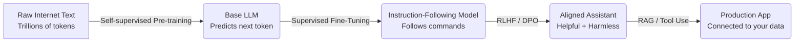

# LLM Foundations Guide 🚀

> A free, community-driven, visual guide to understanding Large Language Models from scratch. No paywalls. No fluff. Just clear explanations with diagrams and runnable code.

---

## 📚 What You Will Learn

This guide covers 12 chapters that take you from **"what is an LLM?"** all the way to **fine-tuning your own generation model**. Each chapter has a Jupyter Notebook with working code you can run on Google Colab (free GPU) or locally.

---

## 🗂️ Table of Contents

| Chapter | Topic | Notebook |
|---------|-------|----------|
| 01 | Introduction to Language Models | [Open](chapters/01_intro/notebook.ipynb) |
| 02 | Tokens and Embeddings | [Open](chapters/02_tokens_and_embeddings/notebook.ipynb) |
| 03 | Inside the Transformer | [Open](chapters/03_inside_the_transformer/notebook.ipynb) |
| 04 | Text Classification | [Open](chapters/04_text_classification/notebook.ipynb) |
| 05 | Text Clustering and Topic Modeling | [Open](chapters/05_clustering/notebook.ipynb) |
| 06 | Prompt Engineering | [Open](chapters/06_prompt_engineering/notebook.ipynb) |
| 07 | Advanced Text Generation | [Open](chapters/07_text_generation/notebook.ipynb) |
| 08 | Semantic Search and RAG | [Open](chapters/08_rag/notebook.ipynb) |
| 09 | Multimodal LLMs | [Open](chapters/09_multimodal/notebook.ipynb) |
| 10 | Creating Text Embedding Models | [Open](chapters/10_embeddings/notebook.ipynb) |
| 11 | Fine-Tuning BERT for Classification | [Open](chapters/11_finetune_bert/notebook.ipynb) |
| 12 | Fine-Tuning Generation Models | [Open](chapters/12_finetune_generation/notebook.ipynb) |

---

## 🏁 How the LLM Journey Works

Here is the big picture before we dive into any chapter:



**Plain English:** The model reads vast amounts of text and learns to predict the next word. We then teach it to follow instructions, align it to be helpful and safe, and finally connect it to your own private data.

---

## 🛠️ Setup

```bash
git clone https://github.com/ashish993/LLM-Foundations-Guide.git
cd LLM-Foundations-Guide
pip install -r requirements.txt
```

Or open any notebook directly in **Google Colab** — click the badge inside each chapter notebook. No local setup required!

---

## 📦 Key Packages

| Package | Purpose |
|---------|---------|
| `transformers` | Load and run any Hugging Face model in 2 lines |
| `datasets` | Access thousands of pre-built benchmark datasets |
| `sentence-transformers` | Build and use semantic embedding models |
| `torch` | PyTorch deep learning backbone |
| `scikit-learn` | Classical ML utilities (classifiers, metrics) |
| `bertopic` | State-of-the-art topic modeling |

See the full [requirements.txt](requirements.txt).

---

## 📖 Chapter Highlights

### Chapter 1 — Introduction to Language Models
> *"How does a machine learn language?"*

Language models learn by reading text and predicting the next word, billions of times. We cover the history: n-gram models → RNNs → Transformers, with visual diagrams at every step.

### Chapter 3 — Inside the Transformer
> *"What actually happens inside ChatGPT?"*

We open the black box. You will understand Attention, Multi-Head Attention, positional encoding, and why Transformers are so powerful — all explained with visuals and analogies.

### Chapter 6 — Prompt Engineering
> *"The art of talking to AI"*

A prompt is not just a question — it is a precise instruction. We explore zero-shot, few-shot, chain-of-thought, and structured output prompting with practical exercises.

### Chapter 8 — Semantic Search & RAG
> *"Giving AI access to your private data"*

RAG (Retrieval Augmented Generation) lets an AI answer questions about documents it was never trained on. It is the most important pattern in enterprise AI today.

### Chapter 12 — Fine-Tuning Generation Models
> *"Make the AI yours"*

Use LoRA (Low-Rank Adaptation) to fine-tune a large model on your own dataset using a single GPU. We walk through every line of code.

---

## 🤝 Contributing

This is a community project! See [CONTRIBUTING.md](CONTRIBUTING.md) to add a chapter, fix a bug, or improve an explanation.

## 📄 License

MIT License — free to use, modify, and share.
